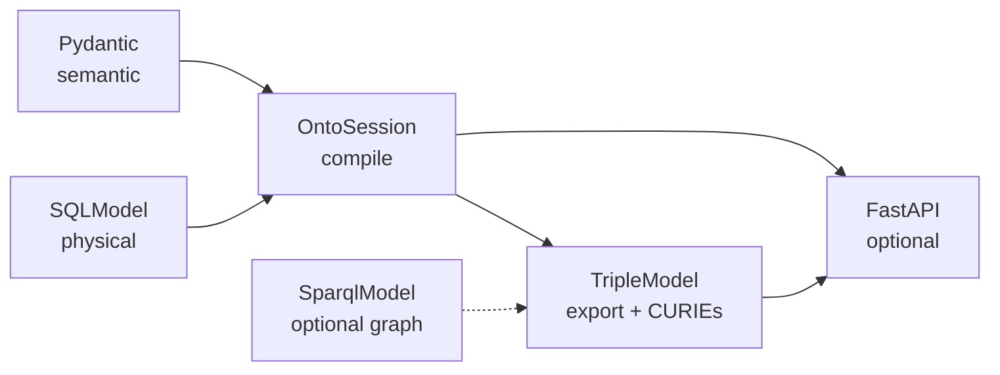

# OntoSQL Dependency Ecosystem Assessment

## Overview

This document evaluates Python dependencies for **ontosql** as a **semantic mapper and session layer** over SQL, with JSON-LD/RDF export as a derivative. OntoSQL sits in an ecosystem with [TripleModel](https://github.com/eddiethedean/triplemodel) and [SparqlModel](https://github.com/eddiethedean/sparqlmodel) — see [ECOSYSTEM.md](ECOSYSTEM.md).

The goal is a small core, optional extras, and Pythonic APIs — not a heavyweight semantic-web framework.

## Dependency philosophy

- Small, stable **core** (semantic + map + session + export)
- **SQLModel** for physical tables only; **Pydantic** for semantic entities
- **TripleModel** as the RDF serialization and CURIE expansion backend
- Optional extras for FastAPI, SparqlModel (graph sync), advanced JSON-LD
- No magical 1:1 table-to-ontology inference

## Core dependencies

### Pydantic v2

- **Semantic models** (`OntoModel`, validation, partial updates)
- JSON schema for OpenAPI enrichment (0.3+)
- Primary type surface for application code

### SQLModel

- **Physical models** (`table=True`)
- SQLAlchemy engine and session integration
- Familiar ergonomics for FastAPI teams

### SQLAlchemy 2.x

- Accessed via SQLModel
- Column expressions, joins, and compiled statements for `OntoSession`
- Core of the mapper compile path

### typing-extensions

- Typing compatibility on Python 3.10+

### TripleModel

- **Core RDF dependency** (replaces RDFLib)
- `expand_curie()` — backing `PrefixRegistry.expand()`
- `Store`, `bind_namespaces`, `serialize()` — `OntoModel.to_jsonld()` / `to_rdf()`
- pyoxigraph graph engine (transitive via TripleModel)
- Shared vocabulary and serialization conventions with SparqlModel

OntoSQL does **not** require apps to subclass `TripleModel`. Export builds a graph from `OntoModel` instances at serialization time.

## Ecosystem dependencies (optional)

### SparqlModel (`ontosql[sparql]`)

- Graph-native ORM sibling to OntoSQL
- `SPARQLSession`, SPARQL query DSL, cascade `put`/`delete`
- Planned for graph sync adapters (0.4) — push/pull between SQL session results and SPARQL stores
- Depends on TripleModel; installing `ontosql[sparql]` pulls both SparqlModel and its TripleModel pin

## FastAPI ecosystem (optional extra)

### FastAPI + orjson (`ontosql[fastapi]`)

- `OntoRouter` CRUD routes with content negotiation (0.3+)
- Dependency-injected `OntoSession` via `onto_session_lifespan`
- `orjson` for fast JSON-LD response bodies

See [SPECS.md](SPECS.md#fastapi-ontosqlfastapi) for production limitations of `OntoRouter`.

## JSON-LD ecosystem (optional extra)

### PyLD (`ontosql[jsonld]`)

- Compaction and framing beyond TripleModel/pyoxigraph basics
- `compact_jsonld` / `frame_jsonld` helpers (0.3+)

## Semantic validation (future extra)

### pySHACL

- Validate graphs generated from maps + session
- Planned for 0.4 (`ontosql[shacl]`)

## Graph database integrations (future)

### SPARQLWrapper

- Remote SPARQL endpoints (may overlap with SparqlModel `HttpStore`)

### Neo4j Python driver

- Hybrid SQL + property graph architectures

Not committed until graph sync adapters are specified in [ROADMAP.md](ROADMAP.md).

## AI and LLM ecosystem (long-term)

### Instructor / PydanticAI

- Structured extraction into `OntoModel` instances
- Aligns with semantic-layer-first design

### DeepOnto

- Ontology alignment and embeddings (research-oriented)

## Developer tooling

| Package | Role |
|---------|------|
| pytest | Tests |
| pytest-asyncio | Async session tests |
| pytest-cov | Coverage |
| pytest-xdist | Parallel runs |
| ty | Static typing (`src/ontosql`) |
| ruff | Lint and format |
| httpx | FastAPI integration tests |
| hatchling | Wheel build |
| aiosqlite | Async SQLite tests |
| greenlet | SQLAlchemy async support in tests |

### mkdocs-material (future)

- Documentation site for 1.0 — not required for 0.2 docs-in-repo

## Extras in pyproject.toml

```toml
[project.optional-dependencies]
fastapi = ["fastapi>=0.100", "orjson>=3.9"]
jsonld = ["PyLD>=3.0"]
sparql = ["sparqlmodel>=0.13.1"]
dev = [
    "pytest>=8",
    "pytest-asyncio>=0.24",
    "pytest-cov>=5",
    "pytest-xdist>=3.8",
    "ty>=0.0.37",
    "ruff>=0.4",
    "httpx>=0.27",
    "fastapi>=0.100",
    "orjson>=3.9",
    "aiosqlite>=0.20",
    "greenlet>=3.0",
    "PyLD>=3.0",
]
# Planned extras:
# shacl = ["pySHACL"]
# graphdb = ["neo4j"]
# ai = ["instructor", "pydantic-ai"]
```

Install examples:

```bash
pip install ontosql
pip install ontosql[fastapi]
pip install ontosql[jsonld]
pip install ontosql[sparql]
pip install -e ".[dev]"
```

## Layer → dependency map



## Strategic recommendations

**Strongest foundational dependencies:**

- Pydantic (semantic)
- SQLModel + SQLAlchemy (physical + compile)
- TripleModel (export + shared RDF stack with SparqlModel)

**Highest-value optional integrations:**

- FastAPI + orjson
- SparqlModel (hybrid SQL + graph)
- PyLD (framing)
- pySHACL (validation — planned)

**Highest long-term opportunities:**

- OntoSQL ↔ SparqlModel graph sync
- PydanticAI / Instructor
- Graph DB adapters
- Polars for ETL pipelines over semantic rows

OntoSQL should expose **semantic model and session APIs**; TripleModel remains the RDF implementation detail except when calling `to_rdf()` / `to_jsonld()` or using FastAPI negotiation helpers.

## Related documents

- [ECOSYSTEM.md](ECOSYSTEM.md)
- [ARCHITECTURE.md](ARCHITECTURE.md)
- [SPECS.md](SPECS.md)
- [ROADMAP.md](ROADMAP.md)
