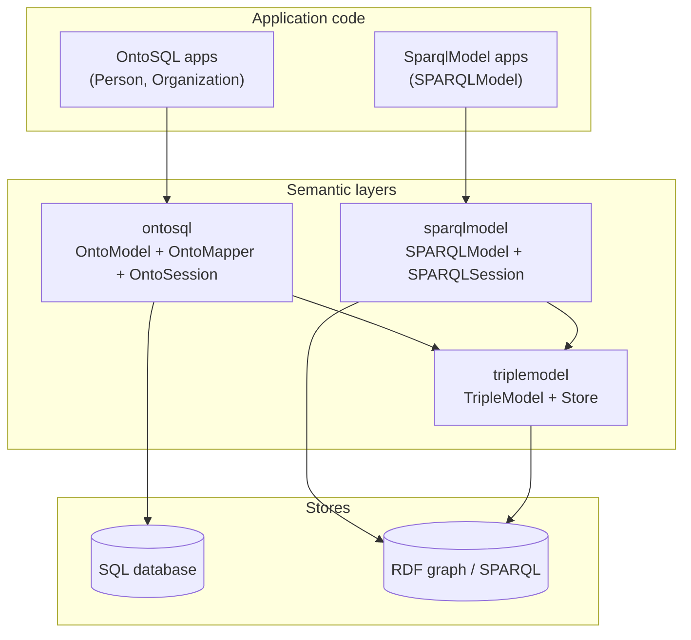

# OntoSQL Ecosystem

OntoSQL is part of a family of Python packages for **typed semantic data**. Each package targets a different persistence layer; they share vocabulary, CURIE handling, and RDF serialization conventions via [TripleModel](https://github.com/eddiethedean/triplemodel).

## Package roles

| Package | PyPI | Persistence | Role |
|---------|------|-------------|------|
| **[TripleModel](https://github.com/eddiethedean/triplemodel)** | `triplemodel` | RDF graphs (pyoxigraph) | Stateless Pydantic ↔ triple mapping, file I/O, SPARQL helpers |
| **[SparqlModel](https://github.com/eddiethedean/sparqlmodel)** | `sparqlmodel` | SPARQL endpoints + in-memory stores | ORM sessions, query DSL, cascade `put`/`delete` over graphs |
| **OntoSQL** | `ontosql` | SQL (SQLModel / SQLAlchemy) | Semantic CRUD over relational schemas via explicit maps |



## How OntoSQL uses TripleModel

OntoSQL depends on **TripleModel** for RDF interoperability:

| OntoSQL surface | TripleModel backing |
|---------------|---------------------|
| `PrefixRegistry.expand()` | `expand_curie()` |
| `OntoModel.to_jsonld()` / `to_rdf()` | `Store`, `bind_namespaces`, graph `serialize()` |
| FastAPI RDF responses | Instance export via TripleModel serializers |

OntoSQL **does not** subclass `TripleModel` for semantic entities. `OntoModel` stays Pydantic-first for SQL-backed apps; export walks `onto_property` metadata and builds a TripleModel graph at serialization time.

## How SparqlModel fits

**SparqlModel** is the graph-native sibling: sessions, SPARQL query compilation, and cascade writes over RDF stores. OntoSQL is the SQL-native sibling: compiled `SELECT`/`INSERT`/`UPDATE` over mapped tables.

Install SparqlModel when you need graph-side tooling alongside OntoSQL:

```bash
pip install ontosql[sparql]
```

**Graph sync (0.4, shipped)** — push/pull between `OntoSession` and RDF graph targets using shared IRIs and TripleModel graphs. See [HYBRID.md](HYBRID.md).

**Hybrid APIs** — SQL operational store + RDF graph mirror or metadata graph (see [HYBRID.md](HYBRID.md)).

**Aligned registries** — `PrefixRegistry` / `OntologyRegistry` for consistent `@context` across SQL and graph exports.

Planned integrations (see [ROADMAP.md](ROADMAP.md)):

- **Neo4j / remote SPARQL** — property-graph and HTTP endpoint adapters beyond in-process `StoreSyncTarget`

## Choosing a package

| You need | Use |
|----------|-----|
| CRUD over existing Postgres/SQLite schemas with ontology-shaped Python models | **OntoSQL** |
| Full graph ORM with SPARQL queries and cascade `put` | **SparqlModel** |
| File parse/serialize, triple mapping, or building custom graph pipelines | **TripleModel** |
| SQL system of record + RDF/JSON-LD API responses | **OntoSQL** (+ optional `ontosql[fastapi]`) |
| Knowledge graph as primary store | **SparqlModel** |
| Round-trip Turtle/JSON-LD files without a session | **TripleModel** |

## Model conventions (cross-package)

When defining models that may appear in both SQL and graph contexts, align these fields:

| Concept | OntoSQL | SparqlModel / TripleModel |
|---------|---------|---------------------------|
| Class type | `type_iri = "schema:Person"` | `rdf_type` / `Rdf.type_uri` |
| Property | `onto_property("schema:name")` | `Field("schema:name")` / `rdf_field(...)` |
| Instance IRI | `iri_template = "https://data.example.org/person/{id}"` | `IRI` / `Rdf.namespace` + `id_field` |
| Prefixes | `PrefixRegistry` / `OntoModel.registry` | `__prefixes__` / `Rdf.prefixes` |

OntoSQL maps are **SQL-specific** (`Map`, `Map.nested`); they are not shared with SparqlModel. Semantic field names and ontology CURIEs should match so export from SQL and graph stores produce compatible JSON-LD.

## Related documents

- [ARCHITECTURE.md](ARCHITECTURE.md) — OntoSQL layers
- [DEPS.md](DEPS.md) — dependency rationale
- [TripleModel ecosystem](https://github.com/eddiethedean/triplemodel/blob/main/docs/ECOSYSTEM.md)
- [SparqlModel ecosystem](https://github.com/eddiethedean/sparqlmodel/blob/main/docs/ECOSYSTEM.md)
