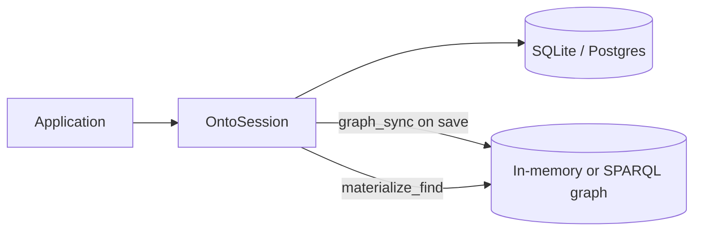

# Hybrid SQL + Graph Deployments

OntoSQL 0.4 closes the loop between **SQL operational stores** and **RDF graphs**. SQL remains the system of record; graphs are derived for interoperability, SPARQL queries, and validation.

See [ECOSYSTEM.md](ECOSYSTEM.md) for how OntoSQL, TripleModel, and SparqlModel fit together.

## Architecture



| Layer | Role |
|-------|------|
| **OntoSession** | CRUD over mapped SQL tables |
| **ontosql.sync** | Push semantic instances to a graph (`patch`, `replace`, `add`) |
| **ontosql.import_** | Hydrate `OntoModel` from JSON-LD / Turtle (no SQL write) |
| **SparqlModel** (`ontosql[sparql]`) | Optional `SPARQLSession` for graph-native reads/writes |
| **ontosql.shacl** (`ontosql[shacl]`) | Generate and validate SHACL shapes from maps |

## Push on save

Wire a graph target when creating a session. Graph updates are **queued** during `save()` and `delete()`, then applied **after the SQL transaction commits** when the session context exits (`__exit__` / `__aexit__`). If the session rolls back, queued graph updates are discarded.

```python
from ontosql import OntoSession
from ontosql.sync import StoreSyncTarget

graph_target = StoreSyncTarget()

with OntoSession(
    engine,
    maps=[PersonMap, OrganizationMap],
    graph_sync=graph_target,
    graph_sync_mode="replace",  # or "patch" (default)
) as session:
    person = session.save(Person(id=1, name="Ada", employer=org))
# Graph is updated here, after commit — not inside save()
```

`flush()` applies pending SQL writes and queues graph sync for those entities; graph updates still run at commit.

`delete()` queues removal of the instance subgraph from the graph target (via `remove_instance`).

`graph_sync` accepts any object with `graph` and `update_graph(add=, remove=)` — including SparqlModel stores that implement the `GraphSyncTarget` protocol.

## Manual push / pull (SparqlModel)

For explicit control, use `OntoGraphSync` with a `SPARQLSession`:

```python
from sparqlmodel import SPARQLSession
from ontosql.sync.sparql import OntoGraphSync

graph_session = SPARQLSession()
sync = OntoGraphSync(graph_session, maps=[PersonMap, OrganizationMap], mode="replace")

sync.push(person)  # SQL instance → graph triples
pulled = sync.pull(Person, iri=sync.instance_iri(person))  # graph → OntoModel (read-only)
```

OntoSQL never converts `OntoModel` to `SPARQLModel`; it writes triples via `store.update_graph`.

## Materialized views

Build a read-only RDF graph from session query results — useful for SPARQL CONSTRUCT endpoints or seeding a graph mirror:

```python
from ontosql.sync.materialize import materialize_find, materialize_entity

graph = materialize_find(session, Person, where=Person.name.startswith("A"), limit=100)
single = materialize_entity(person)
```

## RDF import (round-trip)

Import hydrates semantic instances from RDF using **mapper metadata** (not TripleModel subclassing):

```python
from ontosql.import_ import import_from_jsonld, import_from_rdf

doc = person.to_jsonld()
restored = import_from_jsonld(doc, PersonMap)

turtle = person.to_rdf(format="turtle")
restored = import_from_rdf(turtle, PersonMap, format="turtle")
```

Or via `Person.from_jsonld(doc, mapper=PersonMap)`.

## SHACL validation

Generate shapes from maps and validate exported graphs:

```python
from ontosql.shacl import shapes_from_mapper, validate_instance

shapes = shapes_from_mapper(PersonMap)
report = validate_instance(person, PersonMap, shapes=shapes)
assert report.conforms
```

Requires `pip install ontosql[shacl]`.

## Prefix bundles

Use curated vocabulary defaults for consistent `@context` across SQL and graph exports:

```python
from ontosql import PrefixRegistry

reg = PrefixRegistry.curated("schema_org")  # or "dcterms"
```

## CascadePolicy.REPLACE

When a nested association changes, `REPLACE` deletes the **old** nested row (from session snapshot) before upserting the new one, but only when no other parent row still references that nested row. Use `LINK` or `IGNORE` for shared entities referenced by multiple parents.

## When to use what

| Need | Approach |
|------|----------|
| SQL CRUD + automatic graph mirror | `OntoSession(..., graph_sync=...)` |
| Batch graph push from SQL reads | `materialize_find` |
| SPARQL queries over exported data | `OntoGraphSync` + `SPARQLSession` |
| Validate API payloads / exports | `ontosql.shacl` |
| RDF → Python without SQL | `import_from_jsonld` / `import_from_rdf` |

## Related documents

- [guides/cascade-policies.md](guides/cascade-policies.md) — nested write policies
- [SECURITY.md](SECURITY.md) — graph/SQL consistency
- [SPECS.md](SPECS.md) — API contract
- [ECOSYSTEM.md](ECOSYSTEM.md) — package boundaries
- [examples/hybrid_person_org.py](https://github.com/eddiethedean/ontosql/blob/main/examples/hybrid_person_org.py) — runnable demo
