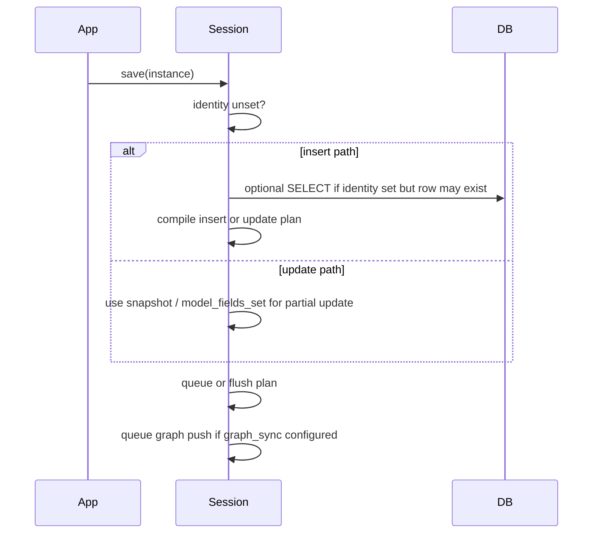

# Session lifecycle (internals)

How `OntoSession` / `AsyncOntoSession` manage SQL transactions, the unit-of-work queue, and optional graph sync. For hybrid deployments see [HYBRID.md](../HYBRID.md).

## Context manager contract

Always use sessions as context managers:

```python
with OntoSession(engine, maps=[PersonMap]) as session:
    ...
```

On **normal exit** (`__exit__` with no exception):

1. **`flush()`** — drain `SessionState.pending` (all queued saves/deletes execute SQL)
2. **`commit()`** — commit the SQLAlchemy transaction
3. **`flush_graph_sync()`** — apply queued graph pushes/removes (after SQL is durable)

On **exception exit**:

1. **`clear_graph_sync()`** — discard queued graph updates
2. **`rollback()`** — SQLAlchemy transaction rollback
3. Pending queue is **not** auto-cleared (see [Rollback](#rollback))

## Save decision tree

`save(instance)` calls `resolve_save_is_new_and_snapshot` in `session/_ops.py`:



- **Insert vs update:** Determined by whether mapper identity is unset (`_identity_unset`) and whether a DB row already exists for that identity (hidden SELECT on save when identity is set).
- **Partial updates:** On update, only fields in `instance.model_fields_set` that map to columns are written (Pydantic “touched fields” semantics).
- **`flush_now=False`:** Plan stays in `pending` until `flush()` or context exit.

## Delete

`delete(instance)` compiles a root-table delete plan, queues graph remove (if configured), and optionally flushes immediately.

## Flush

`flush()` processes `pending` **sequentially**:

- Each successful item is removed from the queue and executed against the **current** SQLAlchemy transaction.
- If item *N* fails, items *N+1…* remain queued; SQL for items *1…N-1* is **not** rolled back automatically.
- Not an atomic multi-item transaction unless the database driver/session already wraps them.

## Rollback

`session.rollback()`:

- Rolls back the **SQLAlchemy** transaction only.
- Does **not** clear `pending`, `identity_map`, or `snapshots` by default.
- Does **not** clear graph sync queues.

After `rollback()`, call `clear_pending()` if you must prevent queued writes from flushing on context exit. Expire cached instances with `session._state.expire(...)` or start a fresh session if identity map state is stale.

Pass `clear_uow=True` on sync/async `rollback()` (0.5+) to also clear pending and graph sync queues.

## Graph sync timing

Graph updates are **queued** during `save()` / `delete()` and applied **after SQL commit**:

| Event | SQL | Graph |
|-------|-----|-------|
| `save()` | Queued or flushed per `flush_now` | Queued push |
| `delete()` | Queued or flushed | Queued remove (root subject only) |
| `commit()` | Durable | Not yet updated |
| `flush_graph_sync()` | — | Push/remove applied |

If graph sync fails after commit, SQL remains committed. `GraphSyncError` is raised; use `retry_graph_sync()` after fixing the target. See [HYBRID.md — split-brain](../HYBRID.md#graph-sync-failures-split-brain).

**Async sessions:** `flush_graph_sync()` is synchronous and may block the event loop for remote graph I/O. Prefer in-memory `StoreSyncTarget` for tests or wrap remote sync in a worker.

## clear_pending vs rollback

| Call | SQL transaction | `pending` queue | Graph queue |
|------|-----------------|-----------------|-------------|
| `rollback()` | Rolled back | Unchanged | Unchanged |
| `rollback(clear_uow=True)` | Rolled back | Cleared | Cleared |
| `clear_pending()` | Unchanged | Cleared | Graph queue unchanged |

## Identity map

`SessionState` caches instances by `(entity_type, identity_value)` using `entity_type.identity_field`. Mappers must use the **same** identity field name as the entity (`MapperRegistry` validates on register).

## Related

- [guides/cascade-policies.md](../guides/cascade-policies.md) — nested write behavior
- [guides/bridge-tables.md](../guides/bridge-tables.md) — collection bridge wipe-and-reinsert
- [TROUBLESHOOTING.md](../TROUBLESHOOTING.md) — common errors
